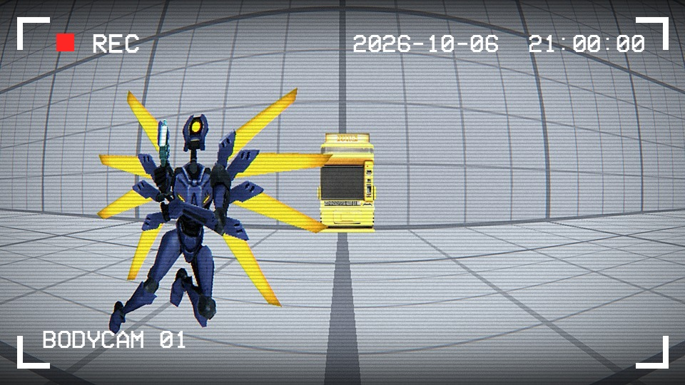

# Ultrakill-PVP

PVP mod for ULTRAKILL. Fight other players with every weapon and arm in the game, with or without Steam.

## Installation

1. Download the latest zip from [Releases](https://github.com/Giaxeri/Ultrakill-PVP/releases).
2. In Steam, right-click ULTRAKILL > Manage > Browse local files.
3. Extract everything from the zip into that folder, next to `ULTRAKILL.exe`.
4. Start the game. There's a new PVP button in the main menu.

Already using BepInEx or r2modman? Just put the zip's `BepInEx/plugins/Ultrakill-PVP` folder in your plugins folder.
Keep `Ultrakill-PVP.dll` and `EOSSDK-Win64-Shipping.dll` together.

Everyone in a lobby needs the same version. The main menu tells you when there's a new one.

## Discord

https://discord.gg/MtmMgxhCC Feedback received!

## Controls

| Key | Action |
|-----|--------|
| T | Chat (you can change it in OPTIONS > CONTROLS) |
| F1 | Hide the HUD |
| F6 | Steam invite |
| F7 | Leave the lobby |
| F8 | Save a diagnostics file for bug reports (`BepInEx/UltrakillPvp_dump.txt`) |
| F9 | Put the mirror dummy in front of you |
| F10 | Freeze the mirror dummy |
| F11 | Sparring: the mirror dummy's projectiles hurt you |
| Punch right before a hit | Parry |
| Mash whiplash | Win a whiplash clash |

To spectate, turn off PVP ENABLED in the pause menu. Fly with the movement keys and the mouse (Jump / Slide go up and
down, Dash or the mouse wheel change the speed). Fire and Alt fire follow the next or previous player.
